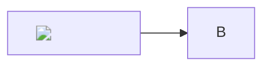

# XSS

<svg onload="window.__xss = 3"></svg>
[click](javascript:window.__xss=4)
<iframe src="javascript:parent.__xss=5"></iframe>
<object data="x"></object>

```mermaid
flowchart LR
  A["<img src=x onerror=window.__xss=6>"] --> B
```
